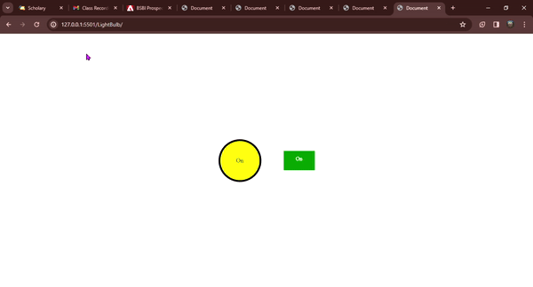

# Light Bulb Toggle with jQuery 💡🔛🔝
A simple yet interactive project demonstrating a light bulb that turns on/off using a clickable switch. Built with HTML, CSS, and the power of jQuery for the toggle functionality, this project showcases basic web development skills and interactivity. Perfect for beginners looking to understand event handling and element styling in web development.

## Features 🚀
Interactive Light Bulb 💡: Changes colour to yellow when turned on and becomes transparent when turned off.
Clickable Switch 🎚: A square switch that toggles the light bulb's state. Changes colour to green with text "Light On" when on and to red with text "Off" when off.
Responsive Design 📱: Crafted to provide a seamless experience across various devices.

## How to Use 🔧
Clone this repository to your local machine.
 [here](https://github.com/Lawani-EJ/jQuery-light-bulb.git)
Open the index.html file in your web browser.
Click the switch to toggle the light bulb on and off.

# Technologies Used 🛠
HTML
CSS
jQuery

## Preview 🌟

# Contributions 🤝
Contributions, issues, and feature requests are welcome! Feel free to check issues page. Make sure to follow the contribution guidelines when you decide to contribute.

## Support 💖
Give a ⭐️ if this project helped you!
